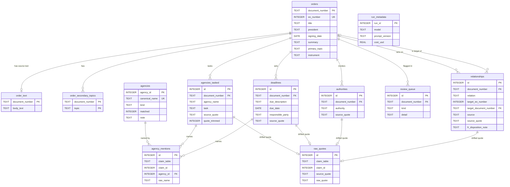

# Data Dictionary — `data/analysis.db`

One extraction run (run 11), its source text, and the Federal Register ground
truth behind it, in a standalone SQLite file. Rebuild with:

```sh
PYTHONPATH=src .venv/bin/python -m eo.cli analysis-db --run-id 11
```

**12 tables, 3 views, 23.7 MB.** Foreign keys are declared and
`PRAGMA foreign_key_check` runs at build time, so a build that would leave a
dangling reference fails instead of writing.

Read [DATA_QUALITY.md](DATA_QUALITY.md) before drawing conclusions from any of it.

---

## Entity relationship diagram



Two relationships in that diagram are **not** enforceable foreign keys, because
they point at more than one table. `agency_mentions` and `raw_quotes` both use a
`(claim_table, claim_id)` pair to identify the row they belong to, so joins must
carry the `claim_table` predicate:

```sql
SELECT a.agency_name, a.source_quote, q.raw_quote
FROM agencies_tasked a
LEFT JOIN raw_quotes q
       ON q.claim_table = 'agencies_tasked' AND q.claim_id = a.id
WHERE a.quote_trimmed = 1
```

Everything else is a real foreign key.

---

## Tables

### `run_metadata` — 1 row

Provenance. Read this first; it says which model produced the data.

| Column | Type | Notes |
|---|---|---|
| `run_id` | INTEGER | PK. 11 for the shipped dataset |
| `model` | TEXT | `openai/gpt-oss-120b` |
| `prompt_version` | TEXT | `v7` |
| `started_at`, `finished_at` | TIMESTAMP | UTC ISO-8601 |
| `input_tokens`, `output_tokens` | INTEGER | 4,555,633 / 2,588,174 |
| `cost_usd` | REAL | 1.0464 |
| `source_database` | TEXT | the working store this was built from |
| `built_at` | TIMESTAMP | when this file was generated |
| `coverage` | TEXT | the ~1994 boundary, in prose |
| `quote_contract` | TEXT | what `source_quote` guarantees |

### `orders` — 1,534 rows

One row per Executive Order: Federal Register ground truth and the model's
order-level fields side by side.

| Column | Type | Null | Notes |
|---|---|---|---|
| `document_number` | TEXT | — | **PK**. FR identifier, e.g. `2025-07835` |
| `eo_number` | INTEGER | — | **UNIQUE**. 12890–14423 |
| `title` | TEXT | — | as published |
| `president` | TEXT | — | 5 distinct values; Trump spans two non-contiguous terms |
| `signing_date` | DATE | — | 1993-12-30 → 2026-08-28 |
| `publication_date` | DATE | — | Federal Register publication |
| `citation` | TEXT | — | e.g. `59 FR 499` |
| `pdf_url` | TEXT | 4% | absent for some early orders |
| `raw_text_url` | TEXT | — | the source this extraction read |
| `disposition_notes` | TEXT | 26% | FR's own cross-reference prose, verbatim |
| `fr_agencies_json` | TEXT | — | FR's agency tagging, JSON array. **Not** the model's |
| `body_char_count` | INTEGER | — | 677 – 154,440 |
| `summary` | TEXT | — | **model prose, unverified** |
| `primary_topic` | TEXT | — | controlled, 15 values — see below |
| `topic_other_reason` | TEXT | 93% | required free text when topic is `other` |
| `secondary_topics_json` | TEXT | — | JSON array; also exploded into `order_secondary_topics` |
| `instrument` | TEXT | — | controlled, 8 values — see below |
| `instrument_other_reason` | TEXT | 94% | as above |
| `finish_reason` | TEXT | — | `stop` for every row; no truncations |

**`primary_topic`** (count): `government_administration` 399,
`energy_and_environment` 189, `foreign_policy` 174, `technology_and_research` 131,
`justice_and_law_enforcement` 130, `health` 108, `security_and_defense` 79,
`trade` 67, `education` 61, `labor_and_workforce` 55, `civil_rights` 44,
`economy_and_finance` 42, **`other` 28**, `immigration` 24, `tribal_affairs` 3.

**`instrument`** (count): `creates_body` 435, `delegates_authority` 368,
`revokes_or_amends` 337, `imposes_sanctions` 161, **`other` 84**,
`directs_report_or_study` 77, `adjusts_pay_or_admin` 62,
`confers_status_or_honor` 10.

Exactly one instrument per order, decided by a precedence rule rather than by
emphasis: new entity → sanctions → revoke/amend → delegation → reports → pay and
admin. See DATA_QUALITY §6.1 — `other` is above its 3% gate at 7.3%.

### `order_text` — 1,534 rows

Source text, split out because it is 15 MB and rarely wanted in a `SELECT *`.

| Column | Type | Notes |
|---|---|---|
| `document_number` | TEXT | **PK**, FK → `orders` |
| `body_text` | TEXT | unwrapped from FR's `<pre>`, boilerplate stripped |
| `body_char_count` | INTEGER | mirrors `orders.body_char_count` |

Every `source_quote` in the database is verifiable against this column.

### `order_secondary_topics` — 313 rows

`secondary_topics_json` exploded so it can be joined. 192 orders have at least
one; most have none.

| Column | Type | Notes |
|---|---|---|
| `document_number` | TEXT | **PK** part, FK → `orders` |
| `topic` | TEXT | **PK** part; same vocabulary as `primary_topic` |

### `agencies_tasked` — 3,195 rows

An agency and what the order directs it to do. **1,007 orders (66%) have at least
one; 527 have none** — which is not evidence the order tasks nobody.

| Column | Type | Null | Notes |
|---|---|---|---|
| `id` | INTEGER | — | **PK** |
| `document_number` | TEXT | — | FK → `orders` |
| `agency_name` | TEXT | — | **as the order names it**, never normalised. Join `agency_mentions` for canonical |
| `task` | TEXT | — | **model prose, unverified** |
| `source_quote` | TEXT | — | verbatim from `order_text.body_text` |
| `quote_trimmed` | INTEGER | — | 1 if the model's quote drifted; original in `raw_quotes` |

### `deadlines` — 2,240 rows

| Column | Type | Null | Notes |
|---|---|---|---|
| `id` | INTEGER | — | **PK** |
| `document_number` | TEXT | — | FK → `orders` |
| `due_description` | TEXT | — | e.g. "within 90 days"; **only 40% parse to a duration** |
| `due_date` | DATE | 27% | populated for 1,643 rows |
| `responsible_party` | TEXT | 13% | normalised via `agency_mentions` |
| `source_quote` | TEXT | — | verbatim |
| `quote_trimmed` | INTEGER | — | as above |

### `authorities` — 1,707 rows

Statutes and constitutional clauses the order invokes.

| Column | Type | Notes |
|---|---|---|
| `id` | INTEGER | **PK** |
| `document_number` | TEXT | FK → `orders` |
| `authority` | TEXT | e.g. `50 U.S.C. 1701` |
| `source_quote` | TEXT | verbatim |
| `quote_trimmed` | INTEGER | as above |

### `relationships` — 5,765 rows

What an order does to other orders. **Two sources with different evidence.**

| Column | Type | Null | Notes |
|---|---|---|---|
| `id` | INTEGER | — | **PK** |
| `document_number` | TEXT | — | FK → `orders`, the acting order |
| `relation` | TEXT | — | 15 values, see below |
| `target_eo_number` | INTEGER | 23% | the EO acted on |
| `target_document_number` | TEXT | 40% | FK → `orders`. **NULL when the target is outside this corpus** |
| `target_type` | TEXT | 13% | `executive_order`, `proclamation`, `memorandum`, `notice`, `determination` |
| `target_label` | TEXT | — | as named in the source, e.g. `Proc. 9704` |
| `in_part` | INTEGER | — | FR's "in part" qualifier |
| `source` | TEXT | — | `model` (1,847) or `fr_disposition_notes` (3,918) |
| `source_quote` | TEXT | 68% | **model rows only** — verbatim from the order |
| `fr_disposition_note` | TEXT | 32% | **FR rows only** — an editorial note *about* the order |
| `quote_trimmed` | INTEGER | — | as above |

`relation`: `amends`, `amended_by`, `continues`, `continued_by`, `references`,
`rescinds`, `rescinded_by`, `revokes`, `revoked_by`, `supersedes`, `superseded_by`,
`supplements`, `supplemented_by`, `suspends`, `suspended_by`. The `_by` forms are
inbound and come only from Federal Register notes — an order's own text cannot
assert what a later order will do to it.

> **The `source_quote` / `fr_disposition_note` split matters.** `source_quote`
> always means verbatim text from that order. Federal Register rows carry no
> `source_quote` because their evidence is a note *about* the order
> ("Revokes: EO 12088, October 13, 1978 (in part)") that appears nowhere inside
> it. The working database stores both in one column; joining that naively makes
> a groundedness check read ~70% instead of 100%.

### `agencies` — 621 rows

Canonical agency identities. 44 matched the alias table; the rest keep their
cleaned surface form.

| Column | Type | Notes |
|---|---|---|
| `agency_id` | INTEGER | **PK** |
| `canonical_name` | TEXT | **UNIQUE** |
| `kind` | TEXT | `body` 577, `office` 21, `department` 18, `official` 4, `collective` 1 |
| `matched` | INTEGER | 1 if the alias table recognised the name, else 0 |
| `note` | TEXT | set on `Department of Defense` only, recording the 2025 War rename |

### `agency_mentions` — 5,785 rows

Bridge, **many-to-many**: one claim can name several agencies
("Attorney General and Secretary of Homeland Security" credits both).

| Column | Type | Notes |
|---|---|---|
| `id` | INTEGER | **PK** |
| `claim_table` | TEXT | `agencies_tasked` or `deadlines` |
| `claim_id` | INTEGER | the row's `id` in that table |
| `agency_id` | INTEGER | FK → `agencies` |
| `raw_name` | TEXT | the name as extracted, preserved |

UNIQUE on `(claim_table, claim_id, agency_id)`, so a claim naming the same agency
twice counts once.

### `raw_quotes` — 540 rows

What the model originally wrote where its quote drifted and was trimmed to the
verifiable span. One row per affected claim; `quote_trimmed = 1` on the claim
marks it, so finding affected rows never needs this join.

| Column | Type | Notes |
|---|---|---|
| `id` | INTEGER | **PK** |
| `claim_table` | TEXT | `agencies_tasked`, `deadlines`, `authorities`, `relationships` |
| `claim_id` | INTEGER | the row's `id` in that table |
| `source_quote` | TEXT | the trimmed, verified text as stored |
| `raw_quote` | TEXT | the model's original |

### `review_queue` — 866 rows across 402 orders

Known-imperfect items, flagged rather than fixed.

| Column | Type | Notes |
|---|---|---|
| `id` | INTEGER | **PK** |
| `document_number` | TEXT | FK → `orders` |
| `kind` | TEXT | see below |
| `detail` | TEXT | what was wrong |
| `created_at` | TIMESTAMP | |

`kind`: `dropped_unverifiable` 259 (claim **not** in the tables),
`ungrounded_agencies_tasked` 241, `ungrounded_deadlines` 156,
`ungrounded_authorities` 77, `ungrounded_relationships` 66 (claim **is** in the
tables, quote trimmed), `relationship` 63 (model contradicted FR),
`other_without_reason` 4.

---

## Views

### `agency_taskings`

**Count agencies with this, not with `agencies_tasked.agency_name`** — the latter
splits Treasury across `Secretary of the Treasury` and `Department of the
Treasury`. Joins `agency_mentions` → `agencies` → the claim → `orders`, so every
row carries president, date, topic and instrument.

```sql
SELECT canonical_name, COUNT(*) AS taskings, COUNT(DISTINCT document_number) AS orders
FROM agency_taskings WHERE kind <> 'collective'
GROUP BY agency_id ORDER BY taskings DESC LIMIT 10;
```

### `revocation_network`

Relationship edges with **both endpoints resolved to real orders**, so it is safe
to group by president. Filtered to `revokes`, `amends`, `supersedes`, `continues`.
1,310 rows. Note this excludes the ~21% of edges whose target is outside the
corpus.

```sql
SELECT source_president, target_president, COUNT(*)
FROM revocation_network WHERE relation = 'revokes'
GROUP BY 1, 2 ORDER BY 3 DESC;
```

### `all_claims`

Every quoted claim in one shape — `claim_table`, `id`, `document_number`,
`claim`, `source_quote`, `quote_trimmed`. 8,989 rows. Federal Register
relationship rows are absent by construction, since they have no `source_quote`.

```sql
-- re-verify the dataset's central contract: expect 8,989 of 8,989
SELECT COUNT(*) FROM all_claims c JOIN order_text t USING (document_number);
```

---

## Worked joins

```sql
-- one order's entire evidence trail, including what the model first wrote
SELECT c.claim_table, c.claim, c.source_quote, q.raw_quote
FROM all_claims c
LEFT JOIN raw_quotes q
       ON q.claim_table = c.claim_table AND q.claim_id = c.id
WHERE c.document_number = (SELECT document_number FROM orders WHERE eo_number = 14081);

-- instrument mix by president
SELECT president, instrument, COUNT(*) n
FROM orders GROUP BY 1, 2 ORDER BY president, n DESC;

-- which agencies a given president tasked most
SELECT canonical_name, COUNT(*) n FROM agency_taskings
WHERE president = 'Barack Obama' AND kind <> 'collective'
GROUP BY agency_id ORDER BY n DESC LIMIT 10;

-- the Department of War period, recovered after the merge into Defense
SELECT raw_name, COUNT(*), MIN(signing_date), MAX(signing_date)
FROM agency_taskings
WHERE canonical_name = 'Department of Defense' AND raw_name LIKE '%War%'
GROUP BY raw_name;

-- orders per president per ACTIVE year (Trump's terms are non-contiguous)
SELECT president, COUNT(*) orders,
       COUNT(DISTINCT substr(signing_date, 1, 4)) active_years,
       ROUND(COUNT(*) * 1.0 / COUNT(DISTINCT substr(signing_date, 1, 4)), 1) per_year
FROM orders GROUP BY president ORDER BY MIN(signing_date);
```

---

## Indexes

`orders` on president, primary_topic, instrument, signing_date;
`agencies_tasked` on document_number and agency_name; `deadlines`, `authorities`
and `review_queue` on document_number; `relationships` on document_number,
target_document_number and relation; `agency_mentions` on agency_id and
`(claim_table, claim_id)`.
