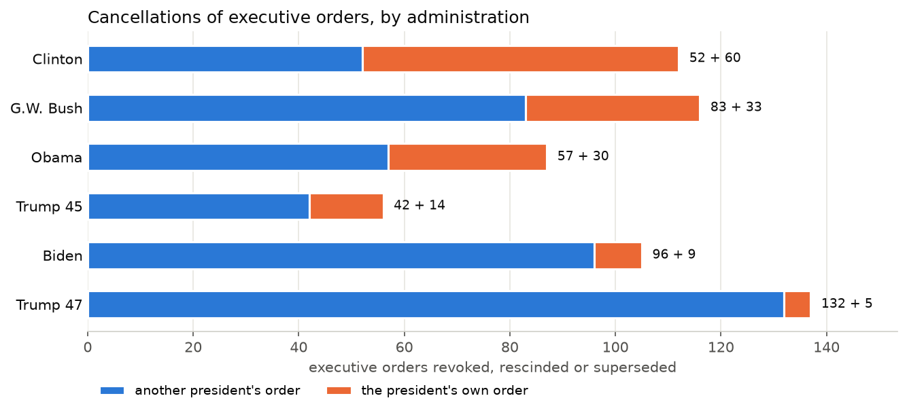
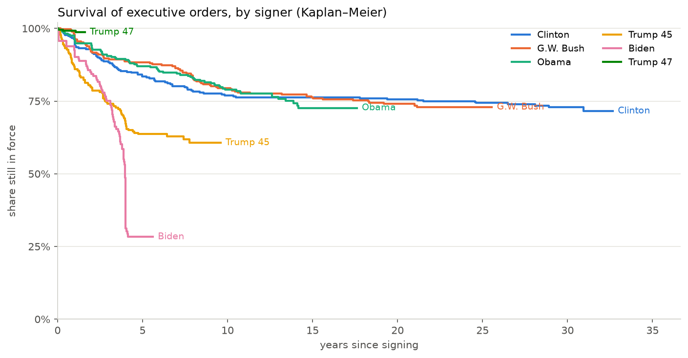
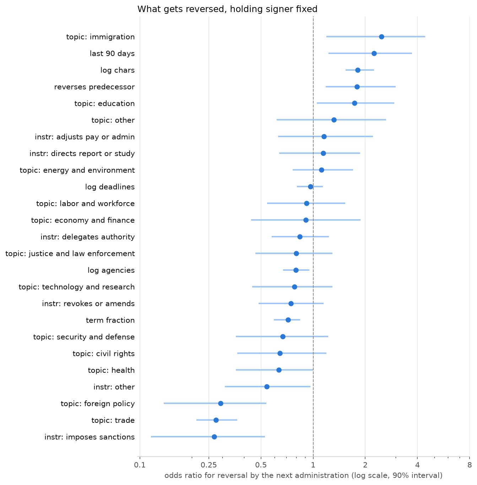

# Executive Order Analysis

A source-verified, queryable dataset of 1,534 U.S. Executive Orders — every order the Federal Register holds full text for, EO 12890 (December 1993) through EO 14423 (August 2026), across six presidencies — and an executed analysis of what it shows.

Each order carries structured fields extracted by a language model (AI) under a fixed schema: a subject domain, the kind of action it takes, the agencies it tasks, the deadlines it sets, the statutes it invokes, and the earlier orders it revokes, amends or continues. Every extracted claim is tied to a quoted span of the source text and verified against it; nothing in the published data rests on a model's unsupported word. The Federal Register's own cross-reference notes are treated as authoritative and the model's data add to them.

The workflow, in one line: ingest from the Federal Register API → extract under a JSON-schema contract → verify every quote against the source → gate the run on eight quality checks → resolve agency names and Federal Register precedence → publish as SQLite and CSV → analyse in a Jupyeter notebook that is committed only after execution and human review.

**Data source.** The [Federal Register API](https://www.federalregister.gov/developers/documentation/api/v1), public domain. The corpus is not "all executive orders": full-text coverage begins in 1994, so orders below EO 12890 are out of scope.

**Query it now, nothing to install.** Open the database in Datasette Lite, which runs entirely in your browser:

> **[data/analysis.db in Datasette Lite](https://lite.datasette.io/?url=https://raw.githubusercontent.com/DaveKT/EO_Analysis/main/data/analysis.db)**

It is a 24 MB download on first open. Start with the `revocation_network`, `agency_taskings` and `all_claims` views, and read the [cheat sheet](docs/INVESTIGATORS_CHEAT_SHEET.md) first: four of the obvious queries are wrong by default.

**See the analysis itself.** Every finding below comes from [notebooks/analysis.ipynb](notebooks/analysis.ipynb), which GitHub renders with its outputs: the queries, the charts (including several not reproduced here), and the caveats stated beside each result. It was committed only after being executed, so what you see there is what the code produced.

| To … | Read |
|---|---|
| Query without tripping over the data | [docs/INVESTIGATORS_CHEAT_SHEET.md](docs/INVESTIGATORS_CHEAT_SHEET.md) |
| Know what to trust, and how much | [docs/DATA_QUALITY.md](docs/DATA_QUALITY.md) |
| Understand the schema and joins | [docs/DATA_DICTIONARY.md](docs/DATA_DICTIONARY.md) |
| Install, rebuild or extend it | [docs/SETUP.md](docs/SETUP.md) |
| See how it was built, and why | [docs/PLAN.md](docs/PLAN.md) |
| Read the analysis | [notebooks/analysis.ipynb](notebooks/analysis.ipynb) |

---

## Method

The project is a rebuild. A first attempt at "sentiment and summary" over the same orders failed silently: empty scrapes produced fluent, wrong summaries, a third of the rows were blank, and nothing reported a problem. It is preserved in [archive/](archive/) as evidence. Every control below exists because of a specific way that went wrong.

### Ingestion

Documents are pulled from the Federal Register's JSON API. Each order's full text is fetched from its `raw_text_url`, unwrapped and stripped of page boilerplate, and stored with the Register's metadata: signing and publication dates, president, citation, agency tags and disposition notes. Ingestion is idempotent and resumable. Of 1,556 documents returned, 22 are excluded as non-orders or duplicates, leaving 1,534.

The Register's disposition notes (e.g. "Revokes: EO 12088", "Superseded by: EO 14354") are parsed into a relationship graph of about 3,900 edges before any model runs, so extraction adds to a known-good base rather than reconstructing what the Register already states.

### Structured extraction

Each order is sent once to a language model (`openai/gpt-oss-120b` via OpenRouter, ~$1 for the corpus) with a versioned prompt and a JSON schema enforced through structured outputs. The contract describes an order on two controlled axes — **`primary_topic`** (fourteen subject domains) and **`instrument`** (seven kinds of action, decided by an explicit precedence rule rather than by judgment about emphasis) — and lists its tasked agencies, deadlines, invoked authorities and relationships to earlier orders. A `significance` rating was designed and then dropped: it had no textual referent and agreed with hand labels 0% of the time.

Extraction is versioned by `(model, prompt_version)`, committed per document, and resumable. The Federal Register layer is never written by a model; every model output is keyed by run, so runs can be compared rather than overwritten.

### Verification and quality gates

**Every claim carries a `source_quote`, and the quote is checked against the order's text** with a matcher that folds typography and is strict about words. A quote that drifts is trimmed to its verifiable span, the model's original is kept, and the groundedness metric scores what the model wrote, so repair cannot inflate it. Claims that cannot be verified at all are dropped and logged.

A run must pass eight gates: severe quote drift, stored-quote verification, null rate, truncation, `other` rate on both axes, agreement with a hand-labelled gold set on each axis, and reported groundedness, with relationship disagreements against the Register sent to a review queue. The shipped run passes seven; the `other` rate fails at 7.3% and is documented as a taxonomy limit rather than re-swept. A head-to-head comparison on 36 orders against a frontier model (`openai/gpt-5.4`) established that the cheap model's topic agreement (80%) was the model's ceiling and not the task's, and the gap is recorded rather than smoothed over.

### Curation

Three curation steps sit between the run and the published data, each with its provenance kept:

- **Federal Register precedence.** Where the Register and the model both speak
  to an (order, target) pair, the Register's row is authoritative and the
  model's is marked superseded. Counting both had inflated the revocation
  network by 27%.
- **Agency entity resolution.** 1,146 raw agency names resolve to 598 canonical
  entities through an alias table with longest-match scanning (never splitting
  on "and"), a many-to-many bridge, and explicit rules for collectives, bare
  in-document references, and the 2025 Department of War rename. The raw name
  is never overwritten.
- **Hand corrections with provenance.** Five topic labels found wrong by the
  analysis were corrected through a build-time corrections file that records
  the model's value, the corrected value and the reason. The model's label is
  kept beside the corrected one; a stale correction fails the build.

### Publication and analysis

The shipped dataset is one run packaged two ways: **`data/analysis.db`**, a standalone SQLite database with foreign keys checked at build time, the source text, and three analysis views; and **`data/export/`**, the same run as CSV with a provenance manifest. Both are committed.

The analysis is a Jupyter notebook that reads the database read-only, contains no pipeline code, and is committed only after execution. Its sections build on one shared definition of "cancellation" and state their caveats inline.

---

## Results

Findings about the orders and the administrations, from [notebooks/analysis.ipynb](notebooks/analysis.ipynb). Every figure here is computed from `data/analysis.db` and reproducible from it. Three caveats apply throughout and are detailed in [docs/DATA_QUALITY.md](docs/DATA_QUALITY.md): the fields come from a cheap model whose recall was never measured, so counts are floors; the corpus begins in 1994; and Trump's two non-contiguous terms are analysed separately.

### Volume: one administration is not like the others

| Signer | Orders | Per active year |
|---|---|---|
| Clinton | 308 | 34 |
| G.W. Bush | 291 | 32 |
| Obama | 276 | 31 |
| Trump 45 | 220 | 44 |
| Biden | 162 | 32 |
| Trump 47 | 277 | in 19 months |

Four administrations cluster at 31 to 34 orders a year. Trump 47 signed 277 in its first nineteen months, more than Biden's whole term.

### Cancelling a predecessor's orders

Revocations, rescissions and supersessions of another president's orders, deduplicated, with targets outside the corpus attributed by EO number range:

| Administration | Another president's orders cancelled | Own orders cancelled |
|---|---|---|
| Clinton | 52 | 60 |
| G.W. Bush | 83 | 33 |
| Obama | 57 | 30 |
| Trump 45 | 42 | 14 |
| Biden | 96 | 9 |
| Trump 47 | 132 | 5 |

The pattern breaks at 2021. Biden more than doubled the prior-president cancellation rate per year, almost entirely against Trump 45 orders (76 of 96). Trump 47 cancelled 132 in under two years, 112 of them Biden's — more than any predecessor managed in a full term. Only Clinton and G.W. Bush reached far back: Clinton cancelled 17 Reagan and 14 Bush 41 orders.



**How to read it.** One bar per administration, oldest at the top. The blue segment is the number of *another* president's orders it revoked, rescinded or superseded; the orange segment is the number of its *own* orders it cancelled. The label at the end of each bar gives both counts. The first four bars are full terms; Trump 47's is nineteen months. What to notice: the blue segments are roughly level for thirty years and then double under Biden and double again under Trump 47, while the orange segment, which was once the larger part of Clinton's bar, all but vanishes — recent administrations cancel their predecessors' orders, not their own.

### How long an order survives

Kaplan–Meier survival, with orders not yet revoked censored at the corpus end:

| Signer | Still in force at 4 years | At 8 years |
|---|---|---|
| Clinton | 85% | 78% |
| G.W. Bush | 89% | 82% |
| Obama | 89% | 83% |
| Trump 45 | 67% | 61% |
| Biden | 31% | — |

Clinton, Bush and Obama orders share one curve: a 10–15% loss in the first four years, then a plateau near 75% that holds for decades. Trump 45 orders fell to 67% and Biden's to 31%, with a median survival of exactly four years — the length of his term. The competing-risks split says who did it: for every earlier signer, revocation within four years was mostly the signer's own doing; for Trump 45 and Biden it was overwhelmingly the successor (27% and 63% of their orders).



**How to read it.** Each line follows the orders one president signed and shows the share still in force as the years pass since signing. Every step down is a revocation. A line ends where that president's follow-up ends — Clinton's orders have been watched for thirty years, Trump 47's for under two — and the method (Kaplan–Meier) makes lines of different length comparable by counting each order only for as long as it has actually been observed. What to notice: Clinton, G.W. Bush and Obama are one line, drifting gently to about 75% and then flat, and the two recent lines break away from it. Biden's drops almost vertically at the four-year mark, which is the moment his successor took office.

### What gets reversed

A logistic model of reversal by the immediate successor within 18 months, on 1,257 orders with a successor (cross-validated AUC 0.83), holding the signer fixed:

- **Tit-for-tat is real.** An order that itself reversed a predecessor's order
  is reversed 39% of the time, against 14% for the rest (odds ratio 1.8).
- **Midnight orders get undone.** Orders signed in the last 90 days of a term
  carry 2.3 times the odds of reversal.
- **Sanctions and foreign-policy orders are the durable core.** Odds ratios of
  0.3 for both; trade orders were never reversed at all (0 of 35).
- **Immigration is the most contested domain** (odds ratio 2.5), and longer,
  more substantive orders are the ones successors bother to undo.

Every succession in this corpus is also a change of party, so "reversed by the successor" and "reversed by the other party" cannot be separated here.



**How to read it.** Each row is one feature of an order. The dot is its odds ratio: how much more (right of the dashed line at 1) or less (left of it) likely an order with that feature is to be reversed by the next administration, compared with an otherwise similar order, once the signer is held fixed. The scale is logarithmic, so 2 and 0.5 are the same distance from 1. The bar is a 90% interval from resampling the data; if it crosses the line, the data cannot tell the effect from zero. What to notice: the rows at the top — an immigration topic, a signing in the last 90 days of the term, a longer text, and having itself reversed a predecessor — are the marks of an order that will be undone, and the rows at the bottom — sanctions, trade, foreign policy — are the marks of one that will be left alone. The `trade` bar is tight only because no trade order was ever reversed and the model's regulariser had to estimate a zero.

### Whom each administration leans on

The share of orders in which the model found at least one tasked agency rises from about half under Clinton and G.W. Bush to 63% under Obama, 77% under Trump 45 and 89% under Trump 47; Biden's orders spread the work widest, at 3.2 agencies per tasking order. Each administration has a signature: Treasury leads from Clinton through Trump 45 (sanctions); Biden's profile is OMB and HHS (17% and 15% of orders); Trump 47's is Justice, Homeland Security and Commerce (21%, 18% and 17%), with Justice tasked in 58 orders — more than any agency in any prior term.

### Subject and instrument

Government administration is the largest domain for every administration, but each departs from the corpus average in its own direction: G.W. Bush 9 points above on government administration, Clinton 6 above on energy and environment, Trump 45 and Biden 4 above on health, Trump 47 7 above on trade — where Biden signed no trade order at all. On the action axis, delegations of authority make up 31% of Trump 45's orders and 42% of Trump 47's, against 14–23% for everyone else; creations of bodies are 23% and 16% of Trump's two terms against Obama's 41%.

### The legal basis orders claim

Parsed from the "By the authority vested in me" clause every order opens with:

- **Most orders cite no statute.** 55% invoke only "the Constitution and the
  laws", and the share climbs steadily from 40% under Clinton to 72% under
  Trump 47.
- **Emergency powers are a constant.** The International Emergency Economic
  Powers Act and the National Emergencies Act appear in 10% of Clinton's orders
  and 16–17% of every administration's since Obama; delegation under 3 U.S.C.
  301 in about a fifth of everyone's.
- **Each era has a signature statute.** The Federal Advisory Committee Act was a
  Clinton habit (11%, then 1–3%). The Immigration and Nationality Act rises from
  zero to 10–11% under Trump 45 and Biden. The Trade Act of 1974 is a Trump 47
  phenomenon at 13% against 0–2% for everyone else.

The same parse gave the dataset its first measured recall figure: the model's `authorities` table names IEEPA in only 45% of the orders that invoke it, and 3 U.S.C. 301 in 7%. For questions about legal authority, parse the preamble.

### What the analysis found wrong, and fixed

Two audits of the weakest field, `primary_topic`, are in the notebook: a cross-validated text classifier, and a cross-check against the statutes each order invokes. Between them they found five boilerplate Railway Labor Act orders carrying four different labels (corrected, with provenance) and left a review list of 72 further candidates, mostly sanctions orders labelled as law enforcement. Nothing on that list has been changed without a human reading the order.

---

## Repository layout

```
data/analysis.db      the dataset, one SQLite file           data/export/   the same run as CSV + manifest
notebooks/            the executed analysis                  docs/          quality, dictionary, cheat sheet, setup, plan
src/eo/               the pipeline (fetch, extract, validate, publish)
corrections/          hand corrections applied at build time, with reasons
gold/                 the hand-labelled gold set             tests/         194 tests, no network
archive/              version 1, kept as a post-mortem
```

Licence for the data: the underlying text is U.S. government work in the public domain. Model-extracted fields and the analysis are provided as-is; read [docs/DATA_QUALITY.md](docs/DATA_QUALITY.md) before quoting any number.
